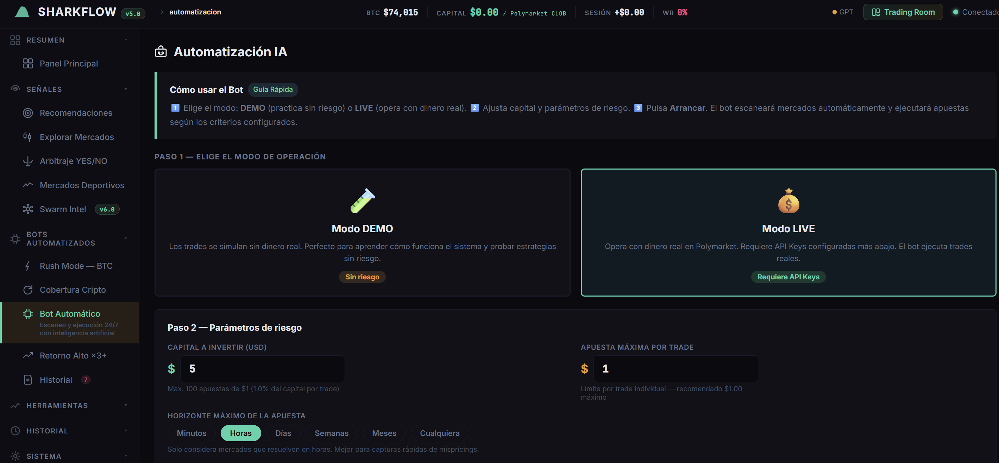

# SharkFlow — Polymarket Trading Bot

**Developed by: Carlos David Donoso Cordero (ddchack)**

Automated trading bot for [Polymarket](https://polymarket.com) with advanced mathematical engine, sentiment analysis, historical backtesting, whale tracker, and a Bloomberg terminal-style web dashboard.



> ⚠️ **Disclaimer**: This software is for educational and research purposes only. Betting on prediction markets carries the risk of total loss of invested capital. Use at your own risk.

---

## Features

- **Math Engine**: Fractional Kelly Criterion, Expected Value, KL Divergence, Bayesian Ensemble, Monte Carlo, ELO, Poisson, VPIN, OBI
- **Calibration**: Platt Scaling, Beta Calibration, Isotonic Regression
- **Rush Mode**: 5-minute BTC strategy with RSI + crowd consensus signals (momentum & mean-reversion)
- **Dump & Hedge**: Dump detection and automatic hedging
- **Escape Room**: High-return opportunities (price ≤$0.33 → return ≥3x) with dual-AI analysis
- **Whale Tracker**: Wallet monitoring with profit history
- **Arbitrage**: Simultaneous YES+NO detection > 100¢
- **LLM Integration**: Claude (Anthropic) + OpenAI for market analysis
- **Dashboard**: Bloomberg terminal dark theme with Chart.js

---

## Architecture

```
sharkflow/
├── backend/
│   ├── api_server.py          # FastAPI server — main entry point (~5000 lines)
│   ├── math_engine.py         # Kelly, EV, edge detection, statistics
│   ├── bayesian_engine.py     # Bayesian engine with ensemble v5.0
│   ├── rush_mode.py           # BTC 5-min strategy (momentum + contrarian)
│   ├── market_scanner.py      # Market scanning via Gamma + CLOB API
│   ├── trading_client.py      # CLOB execution (FOK, limit orders)
│   ├── risk_manager.py        # Adaptive risk management
│   ├── whale_tracker.py       # Large wallet tracking
│   ├── arbitrage_detector.py  # Simultaneous YES+NO detector
│   ├── backtest_engine.py     # Backtesting with resolved markets
│   ├── news_sentiment.py      # News analysis (NewsAPI)
│   ├── llm_engine.py          # Claude + OpenAI integration
│   ├── calibration_v2.py      # Platt/Beta/Isotonic calibration
│   ├── category_models.py     # Category models (politics, sports, crypto)
│   ├── mean_reversion.py      # Mean reversion engine
│   ├── microstructure.py      # VPIN, OBI, orderbook analysis
│   ├── dump_hedge.py          # Dump & Hedge strategy
│   ├── escape_room.py         # High-return strategy
│   ├── sports_data.py         # ESPN + Gamma API client
│   ├── sports_intel.py        # ELO, injuries, altitude
│   ├── auto_allocator.py      # Automatic capital allocation
│   ├── advanced_math.py       # Additional mathematical algorithms
│   ├── ws_client.py           # CLOB WebSocket client
│   ├── extremizer.py          # Probability extremization
│   ├── swarm_engine.py        # Swarm engine
│   └── dashboard.html         # Bloomberg terminal UI (vanilla JS + Chart.js)
├── config/
│   └── .env.example           # Configuration template
├── launcher.py                # Entry point — starts backend
├── start.bat                  # Windows startup script
├── sharkflow_loop.sh          # Bash loop Linux/Mac
├── requirements.txt           # Python dependencies
└── CLAUDE.md                  # Instructions for autonomous SharkBot agent
```

---

## Polymarket APIs Used

| API | URL | Auth | Usage |
|-----|-----|------|-------|
| **Gamma** | `gamma-api.polymarket.com` | None | Markets, metadata, prices |
| **CLOB** | `clob.polymarket.com` | L1/L2 EIP-712 | Orderbook, order execution |
| **Data** | `data-api.polymarket.com` | None | Positions, trade history |

---

## Mathematical Formulas

### Kelly Criterion (25% fractional)
```
f* = (b·p - q) / b
where:
  b = (1/price) - 1   (net decimal odds)
  p = estimated real probability
  q = 1 - p
```

### Expected Value
```
EV = p_real × (1/price - 1) - (1 - p_real)
```
Only bets when `EV > 0.05` ($0.05 per $1 invested).

### Confidence Score (0-100)
Weighted composite:
- Edge magnitude: 30%
- EV magnitude: 25%
- 24h volume: 15%
- Liquidity: 15%
- News sentiment: 10%
- Market spread: 5%

### Rush Mode — Contrarian Signal
```
UP signal:   RSI < 45 (oversold) + crowd bias ≥ 3¢ + no 2-window downtrend
DOWN signal: RSI > 55 (overbought) + crowd bias ≥ 3¢ + no 2-window uptrend
Poly-pure:   BTC lateral (<0.05%) + crowd ≥ 54¢ on one side
```

---

## Setup

### 1. Clone the repository

```bash
git clone https://github.com/ddchack/sharkflow.git
cd sharkflow
```

### 2. Install dependencies

```bash
pip install -r requirements.txt
```

### 3. Configure credentials

```bash
cp config/.env.example .env
```

Edit `.env` with your data:

```env
# Polymarket
POLYMARKET_PRIVATE_KEY=0xYOUR_PRIVATE_KEY_HERE
POLYMARKET_FUNDER_ADDRESS=0xYOUR_PROXY_WALLET_HERE
POLYMARKET_SIGNATURE_TYPE=1   # 1 for Gmail/Magic.link accounts

# LLM (optional — enables AI analysis)
ANTHROPIC_API_KEY=sk-ant-...
OPENAI_API_KEY=sk-proj-...

# News (optional — improves sentiment analysis)
NEWSAPI_KEY=your_newsapi_key

# Server
BACKEND_PORT=8888
```

#### How to get your Polymarket Private Key
1. Go to [reveal.magic.link/polymarket](https://reveal.magic.link/polymarket) (while logged in)
2. Authenticate with your email
3. Copy the private key (starts with `0x...`)

#### How to find your Proxy Wallet (Funder Address)
- The address shown on your Polymarket profile is the **Gnosis Safe proxy** — that is your `FUNDER_ADDRESS`
- The EOA (derived from the private key) is different — **do not use the EOA as the funder**

### 4. Start the server

```bash
# Windows
start.bat

# Linux / Mac
python launcher.py
# or
./sharkflow_loop.sh
```

Dashboard available at: `http://localhost:8888`

---

## Main Endpoints

| Method | Route | Description |
|--------|-------|-------------|
| GET | `/api/status` | Bot status and authentication |
| GET | `/api/markets` | Active Polymarket markets |
| GET | `/api/scan` | Scan opportunities (Kelly + EV + Bayesian) |
| GET | `/api/balance` | USDC wallet balance |
| GET | `/api/risk` | Risk management status |
| GET | `/api/risk/status` | Pauses and consecutive losses |
| GET | `/api/whales` | Large wallet movements |
| GET | `/api/arbitrage` | Arbitrage opportunities |
| GET | `/api/history` | Persistent trade history |
| POST | `/api/trade/auto` | Auto-trading with Kelly |
| POST | `/api/auto-allocate` | Automatic multi-market allocation |
| POST | `/api/rush/start` | Start Rush Mode |
| POST | `/api/rush/stop` | Stop Rush Mode |
| GET | `/api/rush/status` | Rush bot status |
| POST | `/api/escape-room/start` | Start Escape Room bot |
| GET | `/api/escape-room/scan` | Opportunities ≥3x return |
| GET | `/api/sports/markets` | Sports markets |
| GET | `/api/sports/live-scores` | Live ESPN scores |
| WS | `/ws/dashboard` | WebSocket heartbeat + events |

---

## Security

- **DRY RUN enabled by default** — no real trades until explicitly enabled
- Configurable maximum capital (default: $100 USD)
- Automatic stop after 3 consecutive losses (24h pause)
- Credentials stored only in local `.env` — **never committed to the repo**
- L1/L2 EIP-712 signature for Polymarket CLOB authentication

---

## Tech Stack

| Component | Technology |
|-----------|-----------|
| Backend | Python 3.11+, FastAPI, uvicorn |
| Frontend | Vanilla HTML/CSS/JS, Chart.js 4.4.4 |
| Polymarket | `py-clob-client` |
| ML | `scikit-learn`, `numpy`, `scipy` |
| LLM | `anthropic`, `openai` |
| Async HTTP | `httpx` |
| WebSocket | `websockets`, FastAPI WebSocket |

---

## Credits

**Developed by Carlos David Donoso Cordero (ddchack)**

- GitHub: [@ddchack](https://github.com/ddchack)
- Started: December 2025 — refined throughout 2026

### Libraries and resources used
- [Polymarket CLOB Client](https://github.com/Polymarket/py-clob-client) — MIT License
- [FastAPI](https://fastapi.tiangolo.com/) — MIT License
- [Chart.js](https://www.chartjs.org/) — MIT License
- [scikit-learn](https://scikit-learn.org/) — BSD License
- Kelly Criterion formulas based on J.L. Kelly Jr. (1956)
- Platt Scaling calibration: John Platt (1999)

---

## License

MIT License — free for personal and commercial use with attribution.

```
Copyright (c) 2025-2026 Carlos David Donoso Cordero (ddchack)

Permission is hereby granted, free of charge, to any person obtaining a copy
of this software and associated documentation files (the "Software"), to deal
in the Software without restriction, including without limitation the rights
to use, copy, modify, merge, publish, distribute, sublicense, and/or sell
copies of the Software, and to permit persons to whom the Software is
provided to do so, subject to the following conditions:

The above copyright notice and this permission notice shall be included in all
copies or substantial portions of the Software.

THE SOFTWARE IS PROVIDED "AS IS", WITHOUT WARRANTY OF ANY KIND.
```
